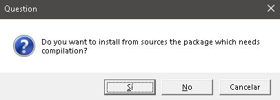
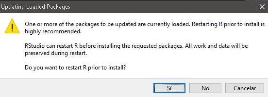

# Connectiviy analysis `cola` 


### Installation 

This package integrates R and Python modules. 

It's required to install several components (once). The structure of this software is:

- R as the base. Use the latest available [here](https://cran.r-project.org/bin/windows/base/)

- Have you [Rtools](https://cran.r-project.org/bin/windows/Rtools/) already? `devtools::find_rtools()` must be TRUE

- Python as the engine for the main scripts

- Miniconda (conda) environment as the package containing all python dependencies

- R shiny for the dashboard Decision support system.


Some of the different computers might have particular conditions or requirements for installing all these components, so we made a section where you can find known issues an their potential solution. If you found a new one please share it with us so potential new users can see it.


#### **1.  Install cola R package.**

Consider use the **option 3 (None)** for installing new packages at the first try. If an error arises, update **all of them (option 1)**.

```
if (!require(devtools)){
   install.packages('devtools')
}
devtools::install_github('connectingLandscapes/cola') ## option 3: None
```

The installation log will shown in console:

```
Downloading GitHub repo connectingLandscapes/cola@HEAD
These packages have more recent versions available.
It is recommended to update all of them.
Which would you like to update?

 1: All                                    
 2: CRAN packages only                     
 3: None                              

 ... (more text)

-- R CMD build -----------------------------------------------------------------------------------------------------------
v  checking for file 'C:\tempR\RtmpM1f5us\remotes11c8f5a7145\connectingLandscapes-cola-5abb74a/DESCRIPTION' (378ms)
-  preparing 'cola': (1.8s)
v  checking DESCRIPTION meta-information ...
-  checking for LF line-endings in source and make files and shell scripts
-  checking for empty or unneeded directories
     NB: this package now depends on R (>= 3.5.0)
     WARNING: Added dependency on R >= 3.5.0 because serialized objects in  serialize/load version 3 cannot be read in older versions of R.  File(s) containing such objects: 'cola/data/crs_df.rda'  'cola/data/perfomance-uper_per.rda'  WARNING: Added dependency on R >= 3.5.0 because serialized objects in  serialize/load version 3 cannot be read in older versions of R.  File(s) containing such objects:  'cola/inst/docs/showcase/showcase.RData'
-  building 'cola_0.1.0.tar.gz'
   
Installing package into ‘C:/Users/Admin/Documents/R/win-library/4.0’
(as ‘lib’ is unspecified)
* installing *source* package 'cola' ...
** using staged installation
** R
** data
*** moving datasets to lazyload DB
** inst
** byte-compile and prepare package for lazy loading
** help
No man pages found in package  'cola' 
*** installing help indices
** building package indices
** testing if installed package can be loaded from temporary location
*** arch - i386
*** arch - x64
** testing if installed package can be loaded from final location
*** arch - i386
*** arch - x64
** testing if installed package keeps a record of temporary installation path
* DONE (cola)
```
  
  Here, the cola R package is installed. Now we need to set up A) the `conda` environment and B) the shiny the dashboard

#####  **2. Setting up cola requirements:**

This might take several minutes and will show the following message once you *get all the steps installed*. But during the first time you will have a longer log. See next section.

```
library(cola)
cola::setup_cola()

  +Step 1/5: Installing & checking reticulate R package
    `reticulate` installed already!
  +Step 2/5 Installing & checking miniconda
    miniconda found at C:/Users/Admin/AppData/Local/r-miniconda!
  +Step 3/5 Installing & checking conda environment
    `cola` conda environment installed in C:\Users\Admin\AppData\Local\r-miniconda\envs\cola/python.exe
    `cola` conda environment named correctly!
    The python version is Python 3.9.19
  +Step 4/5 Installing & checking conda modules
    All required conda modules installed!
  +Step 5/5 Setting up local variables
    === Ready to connect landscapes! ===
```


If there's the first time installing cola you will see the following messages:

----------------------

```
   +Step 1/5: Installing & checking reticulate R package
```


If `reticulate` R package doesn't exists, you need to install it. A prompt asking if you want to install packages that requires compilation will appear. If you say "yes" this might take longer. You can also say "No", but it might require update the packages at some point, depending in your current.



You might need to restart your R session as well. Say "YES".




Also, you might be asked to install a reticulate conda environment. Say "YES".


A correct `reticulate` R package installation will show:

```
  +Step 1/5: Installing & checking reticulate R package
    `reticulate` installed already!
```

----------------------
```
  +Step 2/5 Installing & checking miniconda
```

If miniconda is not installed, you will be asked to accept the installation. Say "yes"


A correct miniconda installation will show:

```
  +Step 2/5 Installing & checking miniconda
    miniconda found at C:/Users/Admin/AppData/Local/r-miniconda!
```

----------------------
```
+Step 3/5 Installing & checking conda environment
+Step 4/5 Installing & checking conda modules
```
This steps creates a conda environment, named `cola` by default. You will ask to create the environment. Say "yes"


It will try several ways in the case some options doesn't works in your machine:
  1. Install the environment using a YML file. If fails,
  2. Creating the environment with the required libraries. If fails,
  3. Create the environment, and then installing each library independently
  
This step will take some minutes since requires download spatial and specialized packages.
A correct installation should shown a message like:

```
  +Step 3/5 Installing & checking conda environment
    `cola` conda environment installed in C:\Users\Admin\AppData\Local\r-miniconda\envs\cola/python.exe
    `cola` conda environment named correctly!
    The python version is Python 3.9.19
  +Step 4/5 Installing & checking conda modules
    All required conda modules installed!
```

----------------------

```
  +Step 5/5 Setting up local variables
```

During this step

```
  +Step 2/5 Installing & checking miniconda
    miniconda found at C:/Users/Admin/AppData/Local/r-miniconda!
  +Step 3/5 Installing & checking conda environment
    `cola` conda environment installed in C:\Users\Admin\AppData\Local\r-miniconda\envs\cola/python.exe
    `cola` conda environment named correctly!
    The python version is Python 3.9.19
  +Step 4/5 Installing & checking conda modules
    All required conda modules installed!
  +Step 5/5 Setting up local variables
    === Ready to connect landscapes! ===
```


equivalent to 
cola::setup_cola(envName = 'cola', libs2Install = c('gdal', 'h5py', 'numexpr', 'rasterio', 'pytables', 'pandas', 'cython', 'numba', 'networkit', 'fiona', 'shapely', 'geopandas', 'scikit-image'), nSteps = 5)


3. Setting up cola dashboard:
```
cola::setup_cola_dss()

    === All libraries required for COLA's DSS installed ===
>
```

4. Run function:
```
cola::setup_cola_dss()

```

5. Run DSS:
```
cola::cola_dss()

    === All libraries required for COLA's DSS installed ===
>
```

6. Uninstall cola:
```
# remove.packages( "cola" )
```


Tests:
- Windows
- Linux

